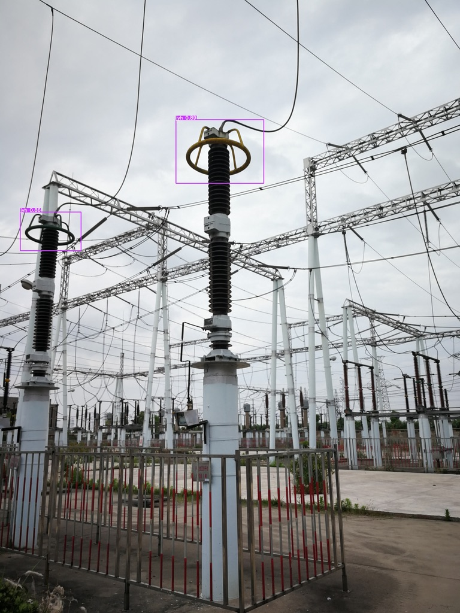
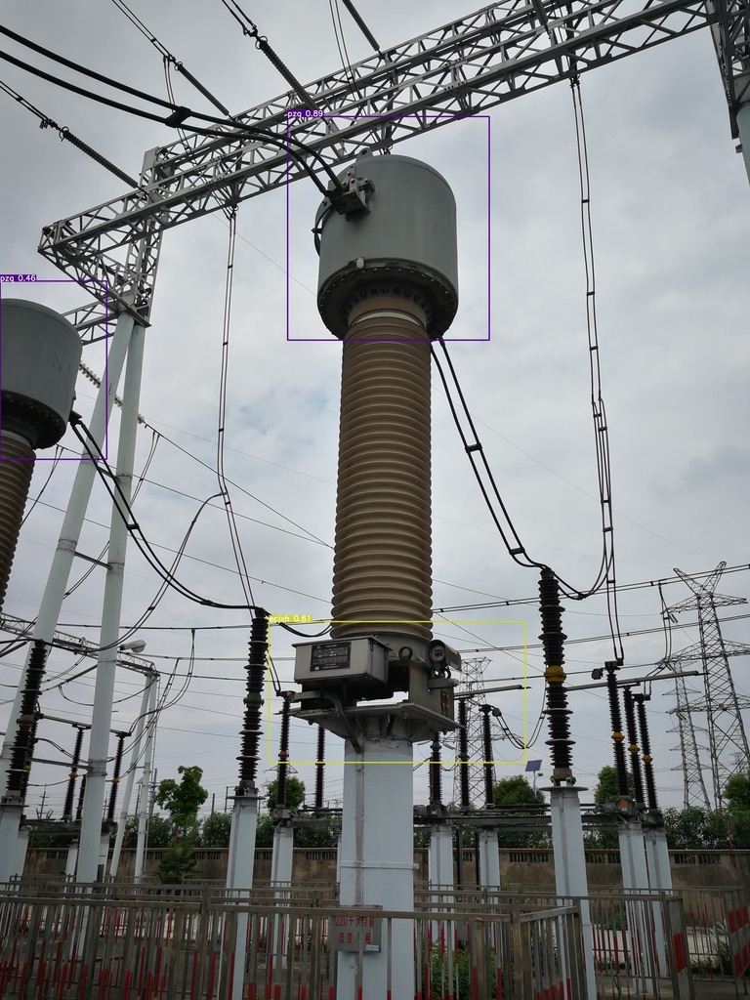

# Defect-Detection-yolov5
This project is based on ultralytics' yolov5 project. The original project can be found [here](https://github.com/ultralytics/yolov5)

This model are designed for a subproject of defect detection. It can detect Multiple equipment components in single image or video stream.


## Requirements
- Python 3.8 or later with all [requirements.txt]
- PyTorch 1.7.0 or later with CUDA and torchvision

### create virtual environment
```bash
python -m venv Defect-Detection
source Defect-Detection/bin/activate 
```
### install requirements
```bash
cd $project_path
pip install -r requirements.txt
```

## Raw data processing

Data should store in yolov5-format dir tree as follow:
```
yolov5_data
└── sub_yolo_data
    ├── images
    │   ├── train
    │   └── val
    └── labels
        ├── train
        └── val
```
Where images should be .jpg format and labels should be yolo .txt format.

For raw data in 缺陷识别 folder, way to process data is as follow:

### Seperate mixed data

In each data folder,images(.jpg files and .JPG files) and labels(.txt files) are mixed together. We need to seperate them into two folders and rename them.
#### Code for replacing space with underscore:

```bash
data_dir="~/Documents/Defect-Detection-yolov5/data/缺陷识别raw/设备部件识别"
cd $data_dir
for f in *; do mv "$f" `echo $f | tr ' ' '_'`; done
```
#### Code for seperating images and labels:
```bash
data_dir="~/Documents/Defect-Detection-yolov5/data/缺陷识别raw/设备部件识别"
touch mvjpg.txt
touch mvxml.txt
find $data_dir -iregex .*\.jpg    > mvjpg.txt
find $data_dir -iregex .*\.xml    > mvxml.txt
mkdir $data_dir/images
mkdir $data_dir/labels
for i in $(cat mvjpg.txt); do (mv $i $data_dir/images); done
for i in $(cat mvxml.txt); do (mv $i $data_dir/labels); done
rm mvjpg.txt
rm mvxml.txt
```

### Deal with images with wrong label in the dataset

Labeling errors are common in the dataset, so we need to deal with them.
For some  unknown reason, labels of some images are rotated by 90 degrees(seems randomly clockwise or counterclockwise).

```bash
# find the images with wrong label
python data/wrong_size.py
```
The outout is a txt file with the path of images with wrong label.including rotated images and images with incorrect label for other reasons.then seperate them from the dataset.

```bash
data_dir="/Users/wzilai/Documents/Defect-Detection-yolov5/data/缺陷识别raw/设备部件识别"
mkdir $data_dir/bad_examples/images
mkdir $data_dir/bad_examples/labels
for i in $(cat $data_dir/wrong_size.txt); do mv $data_dir/images/$i $data_dir/bad_examples/images; done
for i in $(cat $data_dir/wrong_size.txt); do mv $data_dir/labels/$i $data_dir/bad_examples/labels; done
```
You can fix the label of these images manully or just use the remaining images to train the model.

### Change label format
raw labels are stored in xml format,but yolo model need input in yolo-format.
prepare.py can change xml format to yolo-format and separate data into train set and validation set. 
before run prepare.py, you need to change class name and yolo-format dir name in prepare.py. dir create is not fully-automatic in prepare.py, you need to create dir by yourself for now.
#### data dir tree
```
yolov5_data
└── sub_yolo_data
    ├── images
    │   ├── train
    │   └── val
    └── labels
        ├── train
        └── val
```

### Create yaml file
```
yaml file is used to record the project information.
After run prepare.py, create yaml file for dataset, then change train/test image path and class name in yaml file. train.py will automatically read yaml file, and find labels.
```
#### Sample yolov5 yaml file
```yaml
path: ./data/dataset
#train/val/test dir are subdirs of path
train: images/train
val: images/val
test: image/test #can be empty if no test set
#Number of classes
nc: 3
#Classes
names:
  0: cat
  1: dog
  2: person
```

# training

## track and visualize

### yolov5
```python
!pip install comet_ml
```
or
```python
!pip install wandb
import wandb
wandb.login()
```
## train
```bash
python train.py --img 640 //image size
                --batch 16 //batch size
                --epochs 300 //epochs
                --data 设备部件识别_without_ddit_yx_tg.yaml //yaml file path
                --weights yolov5s.pt //pretrained weights
                --device 0 //gpu id, -1 for cpu, 0,1,2,3,... for multi-gpu
                --hyp data/hyp.scratch-low.yaml //hyperparameters

```
you can change hyperparameters in hyp.yaml file.

result for 300 epochs:
```
Class     Images  Instances          P          R      mAP50   
                   all        182        179      0.516      0.583      0.541      0.282
              cysb_sgz        182          3      0.174      0.667      0.159     0.0843
                SF6ylb        182          3      0.556      0.333       0.34      0.238
                   drq        182         31      0.487      0.516      0.344       0.14
                 ecjxh        182          6      0.491      0.324      0.456      0.254
                 drqgd        182          5      0.295        0.6      0.445      0.248
              cysb_lqq        182         23      0.475      0.522      0.508      0.208
            cysb_qtjdq        182         12      0.356      0.583      0.547      0.221
                 xldlb        182         15      0.906      0.733      0.778      0.439
                   ywj        182          2          1      0.977      0.995      0.505
                 jdyxx        182          6      0.352      0.333      0.283      0.231
                  bmwh        182          2      0.798        0.5      0.828      0.133
                xmbhzc        182          1       0.38          1      0.995      0.796
                   pzq        182         22      0.317      0.318      0.256      0.115
                   jyh        182         13      0.923      0.846      0.853      0.472
                   ywc        182         10      0.086        0.2      0.052      0.015
              cysb_cyg        182         25      0.657       0.88      0.814      0.415
``` 

## Detect
```bash
!python detect.py --weights ~/Defect-Detection-yolov5/runs/train/exp21/weights/best.pt --source your_source
```

```
Usage - sources:
    --source 0                               # webcam
             img.jpg                         # image
             vid.mp4                         # video
             screen                          # screenshot
             path/                           # directory
             list.txt                        # list of images
             list.streams                    # list of streams
             'path/*.jpg'                    # glob
             'https://youtu.be/Zgi9g1ksQHc'  # YouTube
             'rtsp://example.com/media.mp4'  # RTSP, RTMP, HTTP stream
```

### Example

